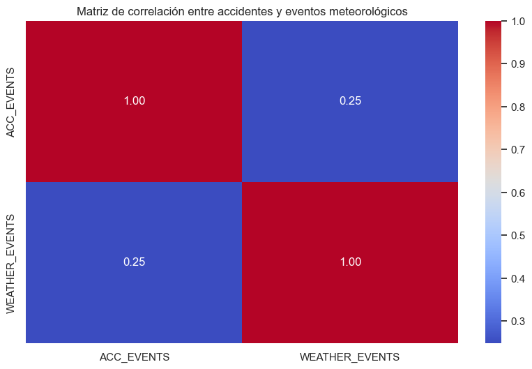
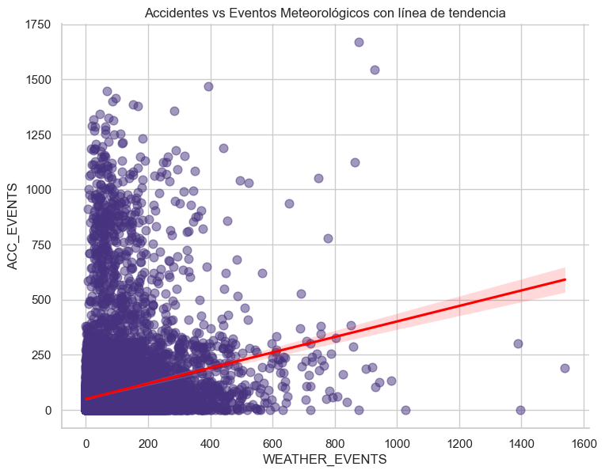
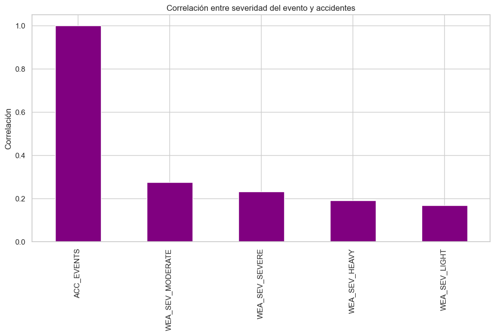
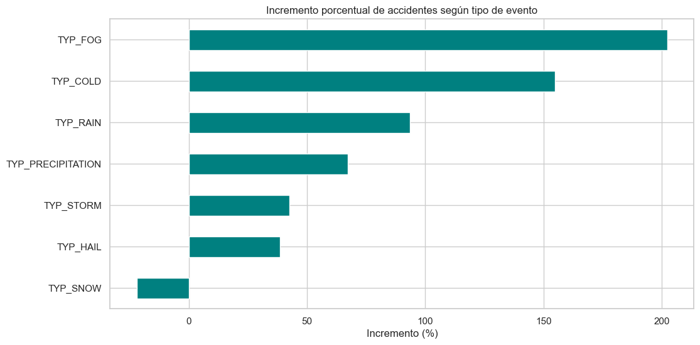
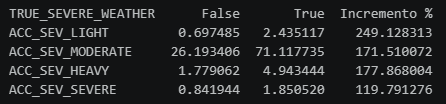
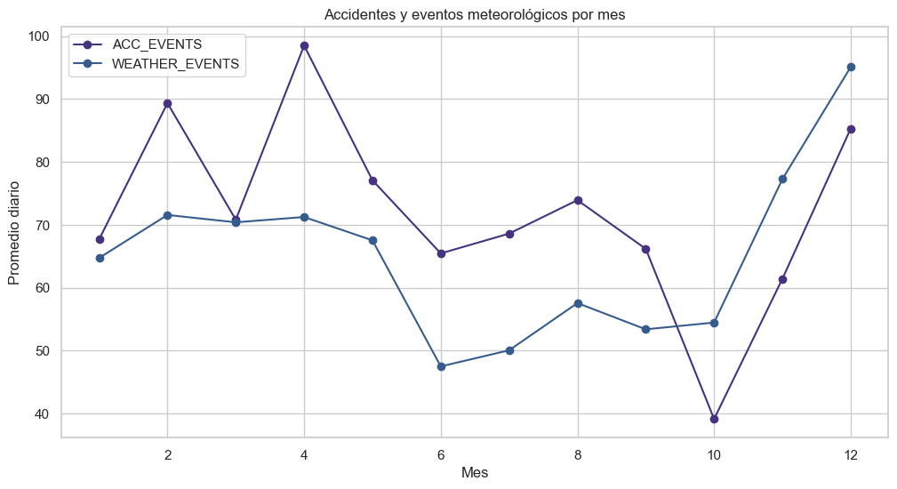
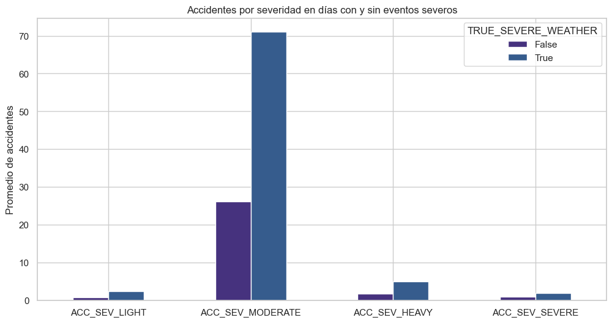

# Análisis de Accidentes de tráfico y Eventos Meteorológicos en Estados Unidos (2022)

## 1. Objetivo del proyecto
Explorar si existe relación entre los accidentes de tráfico y los eventos meteorológicos en Estados Unidos durante el año 2022, evaluando tanto la frecuencia como la severidad de ambos fenómenos.

---

## 2. Datasets utilizados

Los datos provienen de fuentes públicas y cubren información de accidentes y eventos meteorológicos en EE.UU.:

- **United States - Region Codes.csv**  
  Códigos y regiones administrativas de EE.UU.

- **US_Accidents_March23.csv**  
  Dataset de accidentes de tráfico en EE.UU. (Kaggle).

- **WeatherEvents_Jan2016-Dec2022.csv**  
  Dataset de eventos meteorológicos (Kaggle).

NOTA: No se han podido subir los archivos en bruto de los datos por capacidad, en caso de querer consultarlos, los enlaces son https://www.kaggle.com/datasets/sobhanmoosavi/us-weather-events y https://www.kaggle.com/datasets/sobhanmoosavi/us-accidents

Tras el análisis preliminar, filtrado para el año 2022 y la limpieza, se generaron datasets combinados en:

- `Acc_met.csv`  
- `Acc_met_clean.csv`  

El dataset final combina información diaria por estado e incluye:

- **Accidentes totales por día**
- **Accidentes por severidad** (Leve, Moderado, Grave, Fatal)
- **Eventos meteorológicos totales**
- **Eventos por tipo** (Lluvia, Nieve, Niebla, Tormentas, Viento, Granizo)
- **Eventos por severidad** (Leve, Moderado, Fuerte, Severo)

---

## 3. Variables clave del análisis

### Accidentes
- `ACC_EVENTS`
- `ACC_SEV_LIGHT`
- `ACC_SEV_MODERATE`
- `ACC_SEV_HEAVY`
- `ACC_SEV_SEVERE`

### Clima
- `WEATHER_EVENTS`
- `WEA_SEV_LIGHT`
- `WEA_SEV_MODERATE`
- `WEA_SEV_HEAVY`
- `WEA_SEV_SEVERE`

### Tipos de evento meteorológico
- `TYP_COLD`
- `TYP_FOG`
- `TYP_HAIL`
- `TYP_PRECIPITATION`
- `TYP_RAIN`
- `TYP_SNOW`
- `TYP_STORM`

---

## 4.Gráficos incluidos en el análisis

Se incluyen todos los gráficos que aportan información real:

### Correlaciones
- Matriz de correlación  

- Dispersión ACC_EVENTS vs WEATHER_EVENTS  

- Correlación por severidad  

### Impacto porcentual
- Incremento % por tipo de evento  

- Incremento % por severidad del accidente  

### Series temporales
- Accidentes vs eventos meteorológicos por promedio diario por mes   

### Otros
- Comparación de promedio de tipología accidentes en días con y sin clima severo  
  

---

## 5.Metodología

1. **Carga y exploración inicial (EDA_Preliminar)** 
2. **Unión de datasets**   
    - Creación de columnas de recuento
    - Filtrado por año 2022  
3. **Limpieza de datos**  
    - Normalización tipos de datos 
    - Conversión de fechas  
4. **Análisis (EDA) y Visualización** 
  

---

## 6.Conclusiones principales

- La correlación diaria entre accidentes y clima es baja, pese a lo que la intución nos podría hacer pensar.  
- Sin embargo, las tendencias mensuales muestran patrones similares.  
- La niebla y el frío incrementan los accidentes más del 150%, siendo los eventos meteorológicos con mayor impacto relativo.  Sorprende el dato de que los días con eventos de nieve, el numero de accidentes se reduce.
- La severidad del clima no determina la severidad del accidente,  aunque si produce un aumento porcentual significativo en todos los tipos de accidentes. Los eventos severos son raros, pero cuando ocurren incrementan el riesgo general.

---

# 7.Próximos pasos

- Analizar impacto por estado o región.  
- Añadir datos de tráfico real.  
- Crear un dashboard interactivo incluyendo el estado o región

---

# 8.Creación de Dashboard

El objetivo proncipal del dashboard es presentar los datos generales de accidentes y eventos meteorológicos por meses y estado, y el calculo de la correlación entre ambas variables mediante el metodo de Spearman, no incluido de manera estandar en el formulario de excel.

- Se presentan datos generales de numero de accidentes y su clasificación por gravedad.
- Se presentan datos generales de numero de eventos meteorológicos y su clasificación por gravedad.
- Se presenta correlación de Spearman.
- Como parte grafica, se muestran graficos de barras de las distribuciones de accidentes y eventos por mes.
- Se presenta un gráfico de dispersión con una linea de tendendia que marca la correlación entre variables.
- Se introduce un gráfico de anillo de la distribución de los tipos de eventos meteorológicos.
- A toda la infromación anterior se aplica la segmentación por meses y estados.
- Por ultimo se añade un mapa de la localización de los estados por los que se filtra el informe.

